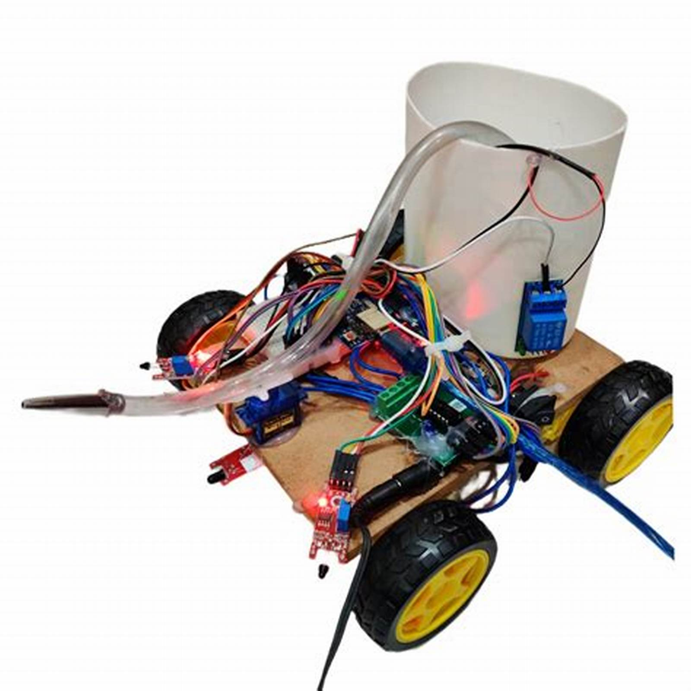

# 🔥 ESP32-Based Fire Fighter Robot

An autonomous and manually controllable firefighting robot built using an ESP32, flame sensors, water pump, servo, and controlled via the Dabble Bluetooth app.

  

---

## 🚀 Features

- Detects fire using 3 flame sensors.
- Automatically navigates and sprays water toward flame.
- Controlled manually using Dabble GamePad (Bluetooth).
- Servo-controlled spray angle (automatic + manual).
- Water pump control.
- Motor control via PWM.

---

## 🎮 Controls (Dabble GamePad)

| Button   | Function              |
|----------|-----------------------|
| Up       | Move forward          |
| Down     | Move backward         |
| Left     | Turn left             |
| Right    | Turn right            |
| Circle   | Move servo right      |
| Square   | Move servo left       |

---

## 🔧 Hardware Required

- ESP32 board  
- 2 DC Motors + L298N driver  
- 3 Flame sensors  
- Water pump module  
- Servo motor (SG90/standard)  
- Power supply (battery)  
- Bluetooth control via Dabble app

---

## 🧠 Logic Overview

- If no input is received from the GamePad, flame sensors guide the robot toward fire.
- Water pump activates when any flame is detected.
- Servo rotates automatically toward the flame direction.
- Manual override using Circle/Square for fine servo positioning.

---

## 📷 Gallery

  

---

## 🛠️ How to Upload Code

1. Connect ESP32 to your computer.
2. Open `FireFighterRobot.ino` in Arduino IDE.
3. Select correct board & port.
4. Install libraries:
   - `DabbleESP32`
   - `ESP32Servo`
5. Upload and enjoy!

---

## 📄 Academic Note

This project was developed as part of my undergraduate coursework.

---

## 🤖 Author

Developed by Dinesh Kanna P(https://github.com/dineshkanna113)

